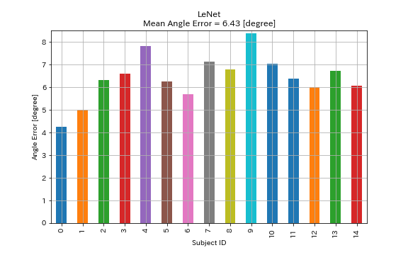
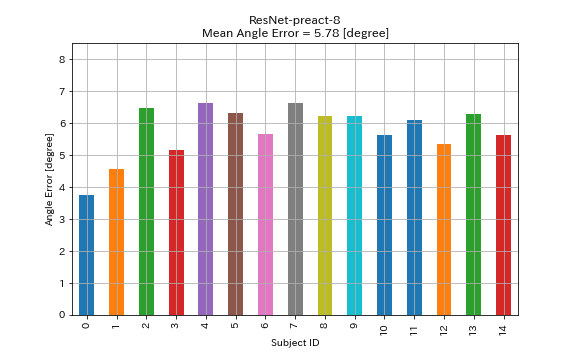

# PyTorch implementation of MPIIGaze

## Requirements

* Python 3.6.3
* PyTorch
* torchvision
* [tensorboard-pytorch]( https://github.com/lanpa/tensorboard-pytorch ) (optional)


## Download the dataset and preprocess it

```
$ wget http://datasets.d2.mpi-inf.mpg.de/MPIIGaze/MPIIGaze.tar.gz
$ tar xzvf MPIIGaze.tar.gz

$ python preprocess_data.py --dataset MPIIGaze --outdir data
```


## Usage

```
$ python -u main.py --arch lenet --dataset data --test_id 0 --outdir results/00
```


## Results

| Model           | Mean Test Angle Error [degree] | Training Time |
|:----------------|:------------------------------:|--------------:|
| LeNet           |              6.37              |      3m40s    |
| ResNet-preact-8 |              5.76              |      7m27s    |

```
$ python -u main.py --arch lenet --dataset data --test_id 0 --outdir results/lenet/00 --batch_size 32 --base_lr 0.01 --momentum 0.9 --nesterov True --weight_decay 1e-4 --epochs 40 --milestones '[30, 35]' --lr_decay 0.1
```



```
$ python -u main.py --arch resnet_preact --dataset data --test_id 0 --outdir results/resnet_preact/00 --batch_size 32 --base_lr 0.1 --momentum 0.9 --nesterov True --weight_decay 1e-4 --epochs 40 --milestones '[30, 35]' --lr_decay 0.1
```




## References

* Xucong Zhang and Yusuke Sugano and Mario Fritz and Bulling, Andreas, "Appearance-based Gaze Estimation in the Wild," Proc. of the IEEE Conference on Computer Vision and Pattern Recognition (CVPR), 2015 [arXiv:1504.02863]( https://arxiv.org/abs/1504.02863 ), [Project Page]( https://www.mpi-inf.mpg.de/departments/computer-vision-and-multimodal-computing/research/gaze-based-human-computer-interaction/appearance-based-gaze-estimation-in-the-wild/ )


